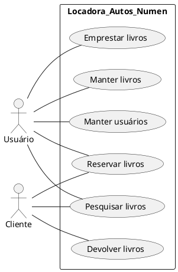
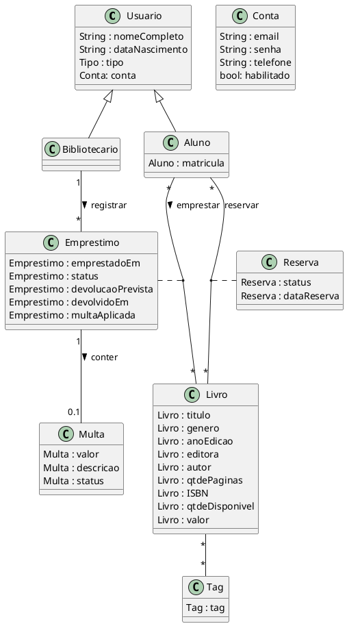
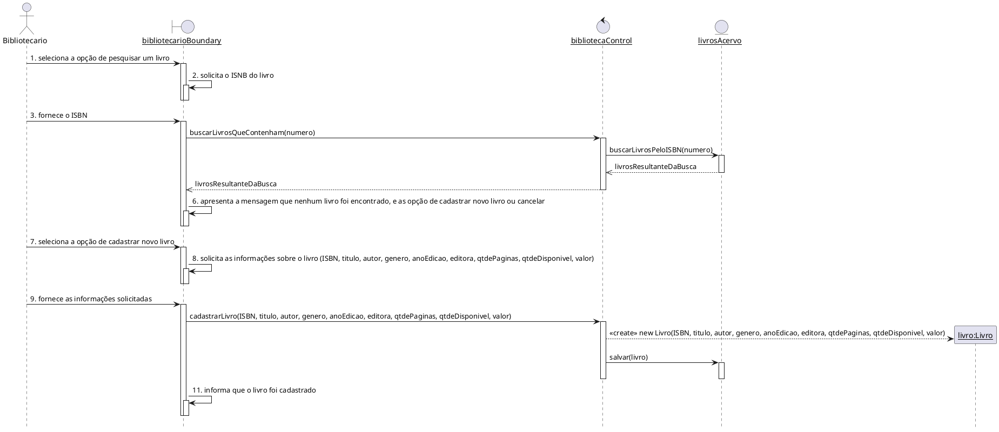
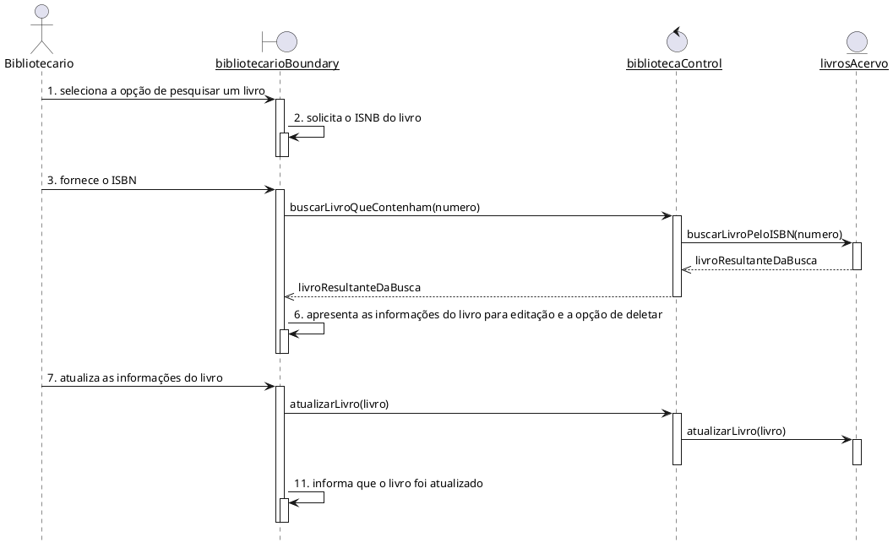
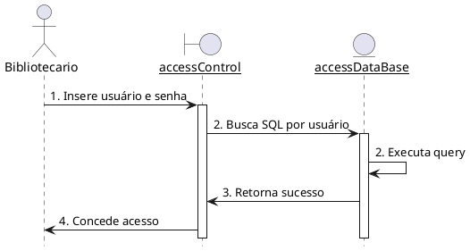
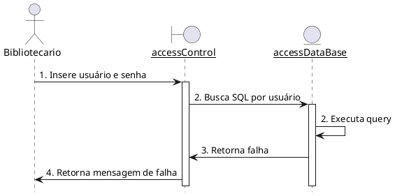
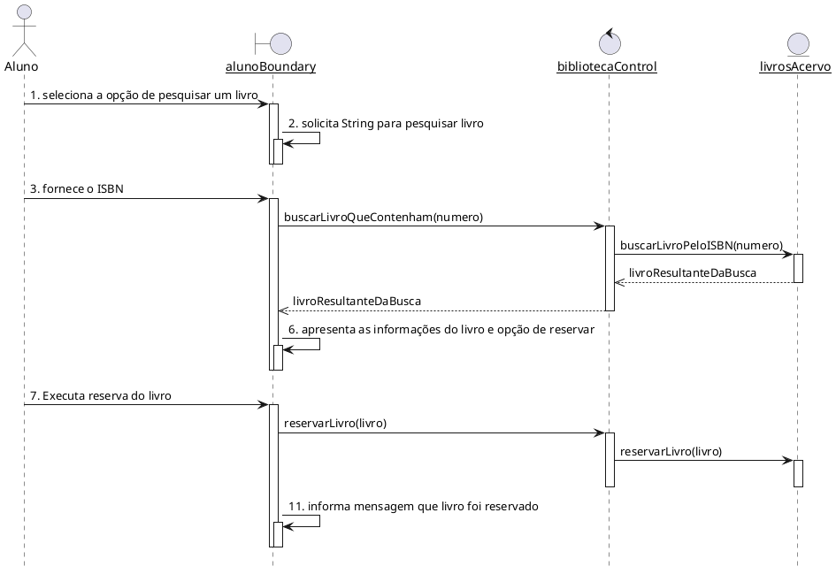
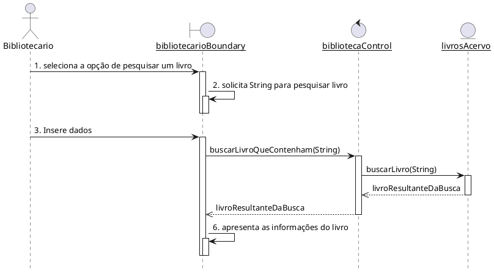
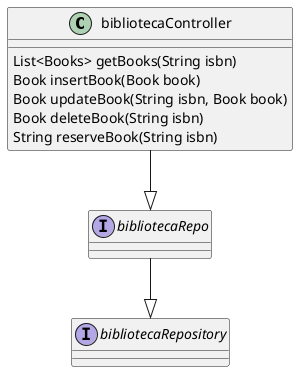

# Sistema de Gerenciamento de Biblioteca

O sistema da Biblioteca Mackenzie é uma plataforma web que proporciona aos alunos cadastrados o empréstimo e reserva de livros.

## 1. Diagrama de Caso De Uso

## 2. Descrição dos Casos de Uso

### 2.1. Manter livros (CDU01)

**Resumo:** O Bibliotecário inclui, atualiza e remove os dados de um determinado livro.

**Ator Principal:** Bibliotecário

**Pré-Condições:** Ser cadastrado no sistema. O livro estar em boas condições e com as informações completas.

**Pós-Condições:** O livro está cadastrado no sistema e disponível para empréstimo.

#### Fluxo principal

1. O Bibliotecário seleciona a opção de pesquisar um livro.
2. O sistema solicita o ISNB do livro.
3. O Bibliotecário fornece o ISBN.
4. O sistema pesquisa pelo número informado.
5. O sistema verifica que não há nenhum livro cadastrado com o número digitado.
6. O sistema exibe uma mensagem que o livro não foi encontrado e fornece a opção de cadastro ou cancelamento da operação.
7. O Bibliotecario seleciona cadastrar.
8. o sistema solicita as informações sobre o livro (ISBN, titulo, autor, genero, anoEdicao, editora, qtdePaginas, qtdeDisponivel, valor).
9. O Bibliotecário fornece as informações solicitadas.
10. O sistema armazena os dados do livro em sua base de dados, gerando um novo registro único.
11. O sistema informa que o livro foi cadastrado.

#### Fluxo alternativo

##### Passo 5 (livro já está cadastrado)

- O sistema apresenta as informações do livro para edição e a opção de excluir.

6. O Bibliotecario atualiza as informações do livro.
7. O caso de uso retorna para o passo 11 do fluxo principal.

### 2.2. Acessar funções restritas (CDU02)

**Resumo:** Para ganhar acesso a informação restritas ou personalizadas, fazer reservas ou outras transações especializadas, um usuário precisa se autenticar e o sistema determinara seu nível de acesso.

**Ator Principal:** Bibliotecário

**Pré-Condições:** O usuário já se registrou.

**Pós-Condições:** O usuário pode obter informações e realizar funções disponível para seu nível de acesso.

#### Fluxo principal

1. O usuário seleciona a operação para efetuar o login.
2. O sistema solicita o seu username e sua senha.
3. O usuário insere seu username e sua senha.
4. O sistema inicia uma sessão.

#### Fluxo alternativo

##### Passo 2 (Apenas o usuário é inválido)

3.  Retorna para o passo 2

##### Passo 3 (Usuário e senha são inválidos)

3. Sistema da uma nova oportunidade para o usuário entrar a senha.
4. Insere nova senha.
5. Sistema verifica se a senha está correta e, se estiver, retorna-se para o passo 4 do fluxo principal, se não estiver, retorna-se para o passo 3 deste fluxo

### 2.3. Reservar livro (CDU03)

**Resumo:** Permite que o usuário faça uma reserva de um livro disponível na biblioteca.

**Ator Principal:** Aluno, Bibliotecário

**Pré-Condições:** O usuário deve estar logado no sistema.

**Pós-Condições:** O livro estar reservado para o usuário.

#### Fluxo principal

1. O usuário pesquisa o livro desejado no sistema.
2. O sistema exibe os resultados da pesquisa.
3. O usuário seleciona o livro desejado.
4. O sistema exibe os detalhes do livro selecionado.
5. O usuário solicita a reserva do livro.
6. O sistema registra a reserva do livro.

#### Fluxo alternativo

##### Passo 6 (Livro não disponível para reserva)

6. O sistema exibe mensagem informando que o livro não está disponível para reserva.

### 2.4. Pesquisar livro (CDU04)

**Resumo:** Permite que o usuário pesquise livros pelo título, autor ou categoria.

**Ator Principal:** Aluno

**Pré-Condições:** O usuário deve estar logado no sistema.

**Pós-Condições:** O livro estará no sistema.

#### Fluxo principal

1. O aluno acessa a funcionalidade de pesquisa de livros.
2. O sistema exibe uma caixa de pesquisa.
3. O usuário insere os termos de pesquisa.
4. O sistema realiza a busca no acervo da biblioteca.
5. O sistema exibe os resultados da pesquisa.

#### Fluxo alternativo

##### Passo 4 (livro não encontrado)

4. O sistema exibe uma mensagem informando que nenhum livro foi encontrado com os termos de pesquisa

## 3. Modelo de Domínio

## 4. Diagramas de Sequência

### 4.1 Manter Livro (CDS01 - Fluxo principal)

### 4.1 Manter Livro (CDS01 - Fluxo alternativo)

### 4.2.1 Acessar funções restritas (CDU02 - Fluxo principal)

### 4.2.2 Acessar funções restritas (CDU02 - Fluxo alternativo)

### 4.3 Reservar Livro (CDS03 - Fluxo principal)

### 4.4 Pesquisar livro (CDU04 - Fluxo principal)

## 5. Diagramas de classes de projeto

